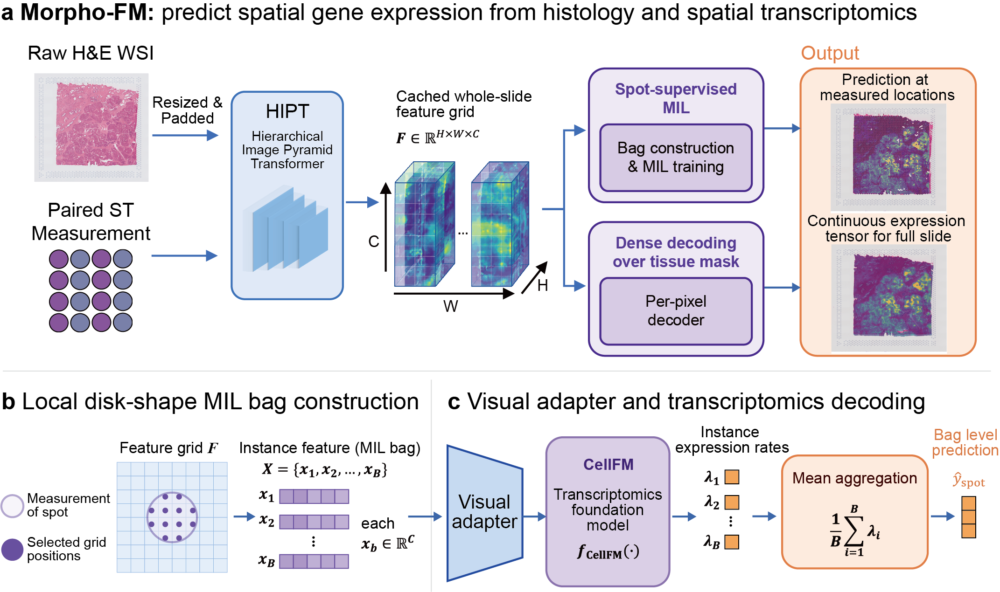

# Morpho-FM

**Spatial molecular reconstruction from routine H&E histology using transcriptomic foundation model priors**

Jinjin Huang<sup>1</sup>, Xiao Feng<sup>1</sup>, Lianghu Qu<sup>1</sup>, Lingling Zheng<sup>1,*</sup>

<sup>1</sup> MOE Key Laboratory of Gene Function and Regulation, State Key Laboratory for Biocontrol,
Innovation Center for Evolutionary Synthetic Biology, School of Life Sciences / School of Agriculture
and Biotechnology, Sun Yat-sen University Shenzhen Campus, Shenzhen 518107, China.

<sup>*</sup> Correspondence: Lingling Zheng
([zhengll33@mail.sysu.edu.cn](mailto:zhengll33@mail.sysu.edu.cn); Tel. +86-0755-23260262)

Morpho-FM reconstructs spatial molecular profiles from routine H&E histology by combining
cell-level morphology representations with transcriptomic foundation model priors. The current
implementation supports multiple-instance learning from cell embeddings to Visium-like spots,
gene-aware decoding with CellFM/scGPT-style priors, negative-binomial supervision, and
whole-slide prediction workflows.

## Workflow



The workflow starts from H&E whole-slide images and matched spatial transcriptomics data. Tissue
regions, spatial spots, and cell-level image patches are prepared first; visual encoders then extract
cell morphology embeddings. Morpho-FM maps these visual embeddings into a transcriptomic
foundation-model space, decodes gene-wise molecular signals, aggregates cell-level predictions to
spatial spots, and evaluates reconstructed spatial expression against measured profiles.

## Highlights

- **Transcriptomic foundation priors**: visual features are adapted to CellFM/scGPT-compatible
  latent spaces to support gene-aware molecular decoding.
- **Cell-to-spot multiple-instance learning**: cell-level predictions are explicitly aggregated to
  spatial transcriptomics spots for training and evaluation.
- **Count-aware objective**: negative-binomial likelihood is used for overdispersed spatial
  expression counts.
- **Whole-slide reconstruction**: the pipeline supports dense inference and downstream spatial
  visualization from routine H&E images.
- **Benchmark-ready notebooks**: tracked notebooks provide standard Morpho-FM workflows and
  comparisons to representative histology-to-transcriptomics baselines.

## Repository Layout

```text
Morpho-FM/
+-- assets/cellfm/                 # Gene vocabulary files used by CellFM-based runs
+-- benchmark/                     # Baseline benchmark notebooks and HEST dataset helper
+-- configs/st_mil.yaml            # Example training/inference configuration
+-- Fig/workflow.png               # Manuscript workflow figure used in this README
+-- notebooks/                     # Main Morpho-FM and Xenium example notebooks
+-- scripts/convert_cellfm_ckpt.py # MindSpore CellFM checkpoint conversion helper
+-- src/st_pipeline/               # Core data, model, training, inference, and super-resolution code
```

Large datasets, checkpoints, raw results, logs, and local figure-generation outputs are intentionally
kept outside version control.

## Installation

Create an isolated Python environment, then install the project dependencies:

```bash
pip install -r requirements.txt
```

For local development, run commands with the repository root on `PYTHONPATH`:

```bash
export PYTHONPATH=src:$PYTHONPATH
```

On Windows PowerShell:

```powershell
$env:PYTHONPATH = "src;$env:PYTHONPATH"
```

## Data and Model Preparation

Morpho-FM expects preprocessed spatial transcriptomics data and cell-level morphology embeddings.
The example configuration in `configs/st_mil.yaml` contains the key paths:

- `data.h5ad_path`: AnnData file containing measured spatial expression.
- `data.cell_emb_h5`: HDF5 file containing cell morphology embeddings and cell barcodes.
- `data.gene_vocab_path`: CellFM gene vocabulary file, such as `assets/cellfm/expand_gene_info.csv`.
- `model.cellfm_checkpoint`: optional CellFM checkpoint converted to PyTorch format.

If starting from a MindSpore CellFM checkpoint, convert it before training:

```bash
python scripts/convert_cellfm_ckpt.py \
  --ckpt /path/to/CellFM_80M_weight.ckpt \
  --out /path/to/CellFM_80M_weight.pt
```

For CellFM 80M weights, use `assets/cellfm/expand_gene_info.csv` as the gene vocabulary.

## Quick Start

Edit `configs/st_mil.yaml` so that all data, embedding, vocabulary, checkpoint, and output paths
point to local files. Then run training:

```bash
PYTHONPATH=src python src/st_pipeline/train/train_cli.py \
  --config configs/st_mil.yaml
```

Run spot-level prediction from a trained checkpoint:

```bash
PYTHONPATH=src python src/st_pipeline/infer/predict_cli.py \
  --config configs/st_mil.yaml \
  --checkpoint checkpoints/st_mil/best_model.pt
```

Add `--save_instance` to also save cell-level predictions.

## Notebooks

Tracked example notebooks:

- `notebooks/01_st_mil_hest_multi.ipynb`: multi-slide Morpho-FM training and prediction.
- `notebooks/02_st_mil_hest_single.ipynb`: single-slide Morpho-FM training and prediction.
- `notebooks/101_xenium_preprocess.ipynb`: Xenium preprocessing example.
- `notebooks/102_xenium_generate_cache.ipynb`: Xenium cache generation.
- `notebooks/103_xenium_train.ipynb`: Xenium model training.
- `notebooks/104_xenium_predict.ipynb`: Xenium prediction and visualization.

## Benchmark Suite

The public benchmark suite currently includes six representative histology-to-transcriptomics
methods. These notebooks are the clean, tracked entry points intended for GitHub:

| Method | Notebook | Scope |
| --- | --- | --- |
| HisToGene | `benchmark/01_HisToGene_benchmark.ipynb` | Transformer-based spot expression prediction |
| iStar | `benchmark/02_iStar_benchmark.ipynb` | Image-to-ST prediction and spatial enhancement baseline |
| mclSTExp | `benchmark/03_mclSTExp_benchmark.ipynb` | Contrastive learning baseline for ST expression prediction |
| sCellST | `benchmark/04_sCellST_benchmark.ipynb` | Cell-aware spatial transcriptomics prediction baseline |
| THItoGene | `benchmark/05_THItoGene_benchmark.ipynb` | Histology-to-gene transformer baseline |
| HiST | `benchmark/06_HiST_benchmark.ipynb` | Histology-based spatial transcriptomics baseline |

Local protocol variants, including kidney-specific, single-slice, INTxx, cached result, and
method-source directories, are useful for experiments but should stay out of the public README
unless they are intentionally cleaned and tracked.

## External Components

External repositories and pretrained weights are not vendored in this repository. If needed, place
local copies under `third_party/` and keep them untracked:

- CellFM: <https://github.com/biomed-AI/CellFM>
- HEST: <https://github.com/mahmoodlab/hest/>
- LazySlide: <https://github.com/rendeirolab/LazySlide>
- sCellST: <https://github.com/mahmoodlab/sCellST>

## Version-Control Hygiene

Before publishing or pushing changes, check the exact files that will be included:

```bash
git status --short
git diff -- README.md
```

For this README update, the only manuscript figure that needs to accompany the documentation is:

```text
Fig/workflow.png
```

Do not add local outputs such as `figures_*`, `results/`, `checkpoints/`, `logs/`, `scratch/`,
temporary notebooks, or private manuscript files.

## Citation

If you use Morpho-FM, please cite the manuscript:

```bibtex
@article{huang2026morphofm,
  title  = {Morpho-FM: spatial molecular reconstruction from routine H&E histology using transcriptomic foundation model priors},
  author = {Huang, Jinjin and Feng, Xiao and Qu, Lianghu and Zheng, Lingling},
  year   = {2026},
  note   = {Manuscript in preparation}
}
```

## Contact

For questions about the method or manuscript, please contact Lingling Zheng at
[zhengll33@mail.sysu.edu.cn](mailto:zhengll33@mail.sysu.edu.cn).
